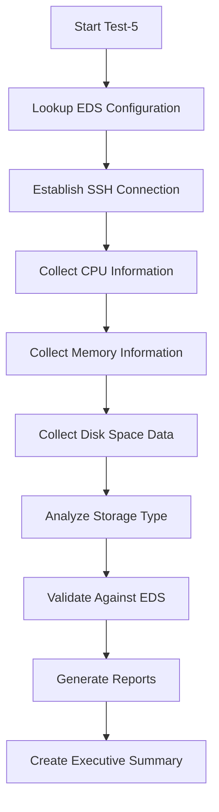

# 🗄️ Test-5: Storage & System Validation

## 📋 **Test Overview**

**Test Suite Name**: Test-5 Storage & System Validation
**Purpose**: Validate disk space allocation, CPU cores, memory, and storage configuration against EDS (Configuration Baseline Sheet) requirements
**Scope**: System resource validation and compliance verification

## 🎯 **Test Objectives**

### **Primary Validations**
1. **💻 CPU Core Validation** - Verify CPU core count matches EDS specification
2. **🧠 Memory Allocation** - Validate RAM allocation against EDS requirements
3. **💾 Disk Space Allocation** - Compare actual disk space with EDS allocation
4. **📡 Storage Type Verification** - Validate storage infrastructure type
5. **🗂️ Filesystem Configuration** - Verify root filesystem and mount points

### **Secondary Analysis**
1. **📊 Storage Capacity Analysis** - Overall storage utilization patterns
2. **🏗️ Volume Group Analysis** - LVM configuration and logical volumes
3. **🖥️ Operating System Validation** - OS type compliance with EDS

## 🔍 **Test Process Flow**



## 📊 **EDS Fields Validated**

| **EDS Column** | **Robot Variable** | **Validation Type** |
|----------------|-------------------|-------------------|
| Number of CPU Cores (recom) | `${TARGET_CPU_CORES}` | **Critical** |
| RAM | `${TARGET_RAM}` | **Critical** |
| Storage Type | `${TARGET_STORAGE_TYPE}` | **Informational** |
| Storage Total TB | `${TARGET_STORAGE_TOTAL_TB}` | **Analysis** |
| Storage Allocation (GB) | `${TARGET_STORAGE_ALLOC_GB}` | **Critical** |
| Files System | `${TARGET_FILE_SYSTEM}` | **Compliance** |
| Logical Volume Name/Partition | `${TARGET_LOGICAL_VOLUME}` | **Compliance** |
| OS Type | `${TARGET_OS_TYPE}` | **Informational** |

## 🖥️ **System Commands Executed**

### **CPU Information Collection**
```bash
nproc                    # Core count
lscpu                    # Detailed CPU information
lscpu | grep "Model name" # CPU model
```

### **Memory Information Collection**
```bash
free -h                  # Human-readable memory info
free -m                  # Memory in MB
cat /proc/meminfo        # Detailed memory statistics
```

### **Storage Information Collection**
```bash
df -h                    # Disk usage summary
lsblk                    # Block device information
fdisk -l                 # Partition information
mount | grep -E "^/"     # Mount points
vgs                      # Volume groups (if LVM)
lvs                      # Logical volumes (if LVM)
```

## 📁 **File Structure**

```
test5_disk_space_validation/
├── disk_space_validation.robot    # Main test suite
├── storage_keywords.resource       # Storage & system keywords
├── variables.resource             # Test-specific variables
└── README.md                      # This documentation
```

## 🚀 **How to Run Test-5**

### **Individual Test Suite Execution**
```bash
# Navigate to test directory
cd tests/test5_disk_space_validation

# Run Test-5 with comprehensive reporting
robot --variable SSH_USERNAME:your_username \
      --variable SSH_PASSWORD:"your_password" \
      --variable TARGET_HOSTNAME:alhxvdvitap01 \
      --outputdir ../../results/test5 \
      --name "Storage & System Validation Test-5" \
      --metadata "Environment:Production" \
      --metadata "EDS_Validation:Storage_CPU_Memory" \
      disk_space_validation.robot
```

### **Using PowerShell Runner**
```powershell
# Run all tests including Test-5
.\run_all_tests.ps1 -Username "your_username" -Password "your_password" -TargetHostname "alhxvdvitap01"
```

## 📊 **Generated Reports**

### **📄 Data Files** (`results/test5/data/`)
- `cpu_information_YYYYMMDD_HHMMSS.txt` - CPU core count and model details
- `memory_information_YYYYMMDD_HHMMSS.txt` - RAM allocation and usage stats
- `disk_space_information_YYYYMMDD_HHMMSS.txt` - Comprehensive storage data

### **📈 HTML Reports** (`results/test5/`)
- `log.html` - Detailed execution log with all commands and outputs
- `report.html` - Test results summary with pass/fail status
- `output.xml` - Machine-readable test results

### **📋 Executive Summary**
- `Test5_Storage_Executive_Summary.txt` - Business-ready compliance report

## ✅ **Test Cases**

| **Test Case** | **Priority** | **Description** |
|---------------|-------------|----------------|
| CPU Cores Validation | **Critical** | Validates CPU core count matches EDS |
| Memory Allocation Validation | **Critical** | Validates RAM allocation matches EDS |
| Disk Space Allocation Validation | **Critical** | Validates storage allocation against EDS |
| Storage Type Validation | **Critical** | Validates storage infrastructure type |
| Root Filesystem Validation | **Critical** | Validates filesystem configuration |
| Storage Capacity Analysis | Normal | Analyzes overall storage utilization |
| Volume Group Analysis | Normal | Analyzes LVM configuration |
| Operating System Validation | Normal | Validates OS type compliance |

## 🎨 **Key Features**

### **🌟 Comprehensive Data Collection**
- **CPU**: Core count, model, architecture details
- **Memory**: Total RAM, available memory, swap configuration
- **Storage**: Disk usage, partition layout, filesystem types
- **Infrastructure**: Storage type detection, volume groups

### **🔧 Intelligent Validation**
- **Exact Matching**: CPU cores must match EDS exactly
- **Tolerance-Based**: Memory validation allows 1GB variance
- **Informational**: Storage type validation for review
- **Compliance**: Filesystem configuration logging

### **📊 Professional Reporting**
- **Real-time Console**: Emoji-enhanced progress indicators
- **Executive Summaries**: Business-ready compliance reports
- **Technical Details**: Complete command outputs and data
- **Evidence Collection**: Timestamped data files for audit

## 🔧 **Configuration**

### **Memory Tolerance**
```robot
${MEMORY_TOLERANCE_GB}    1.0    # Allow 1GB difference for memory validation
```

### **Disk Usage Thresholds**
```robot
${DISK_USAGE_WARNING}     80     # Warn if usage exceeds 80%
${DISK_USAGE_CRITICAL}    90     # Critical if usage exceeds 90%
```

## 🏆 **Success Criteria**

### **✅ Test Passes When:**
- CPU core count exactly matches EDS specification
- Memory allocation is within 1GB tolerance of EDS requirement
- All system data successfully collected and logged
- Storage configuration documented for compliance review

### **❌ Test Fails When:**
- CPU core count doesn't match EDS specification
- Memory allocation differs by more than 1GB from EDS
- SSH connection fails or commands cannot be executed
- Critical system information cannot be collected

## 🔗 **Integration**

### **EDS Integration**
- Automatically reads server configuration from `EDS_Itential_DRAFT_v0.01.xlsx`
- Maps Excel columns to test variables
- Validates actual server configuration against EDS baseline

### **Framework Integration**
- Compatible with `run_all_tests.ps1` PowerShell runner
- Generates consolidated reports with other test suites
- Follows established Robot Framework patterns

## 📈 **Benefits**

### **🎯 Compliance Assurance**
- Ensures servers meet documented resource specifications
- Provides audit trail for configuration management
- Validates infrastructure against approved baselines

### **🔍 Comprehensive Analysis**
- Collects both high-level metrics and detailed system information
- Supports root cause analysis for performance issues
- Documents storage architecture for capacity planning

### **📊 Professional Documentation**
- Executive summaries suitable for management review
- Technical details for engineering teams
- Compliance reports for audit requirements

---

## 🌟 **Status: Ready for Production Testing**

✅ **Complete test suite implemented**
📊 **Comprehensive system resource validation**
🚀 **Integrated with existing test framework**
📋 **Professional reporting and documentation**

Test-5 is ready to validate storage and system configurations against EDS requirements! 🗄️